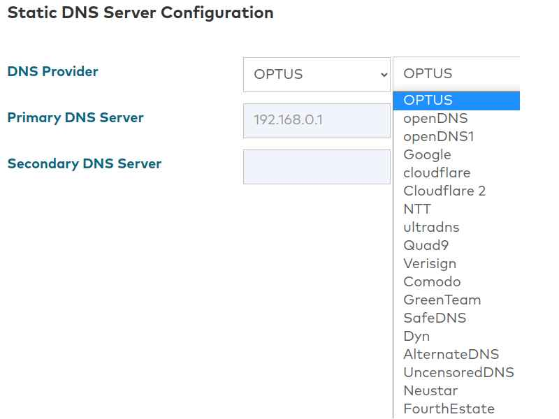

# OptusDNSBypass
An automated bypass to the locked DNS interface on the Optus Sagemcom 5393 router.
- This bypasses the locked DNS settings by simulating the API calls made by the router to its internal firmware
- This could be developed further to automate other router configurations

## Target Router / Firmware
This information is available on the router admin login home page
- Firmware version: SGKY10000893
- Hardware version: FAST5393LTE-A
- Serial number: N7230629B006867

## Pre-requisites
- Node v17.9.0

## How to Use?
1. Copy `settings.conf.sample` and rename to `settings.conf`
2. Populate the fields: host, password, dns1, dns2
   - username is default `optus`
   - leave `modifyDNS` as `false` for now
3. Run `node app.js` in console
4. You will see the current DNS settings logged to the console in the field `"dnsservers":"<dns1>, <dns2>"`
5. Change `modifyDNS` in the config file to `true`
6. Run `node app.js` in console, to update the DNS
7. Wait 10 seconds for the router to update its configurations
8. Change `modifyDNS` in the config file to `false`
9. Run `node app.js` in console once more to view the applied settings

## Admin Panel Locked DNS
When attempting to customise the DNS from admin panel, you are only provided the options of choosing from a pre-selected list (see image). This may be sufficient for most purposes, however this would make infeasible to hook in a [Pi-hole](https://pi-hole.net/) at the router level.

**Note:** There is no custom DNS option.
 

### FAQs
The DNS has not changed when viewing from the router admin panel?
- This is expected, however when you view the DNS from the API using the scripts, you will see the newly applied DNS in the field `"dnsservers":"<dns1>, <dns2>`"
- The router admin panel seems to get confused and **will not** display correctly as the new DNS is not from the pre-selected options
- The current DNS settings can also be view by visiting http://\<router-ip\>/api/v1/dhcp **after** logging into the admin panel
